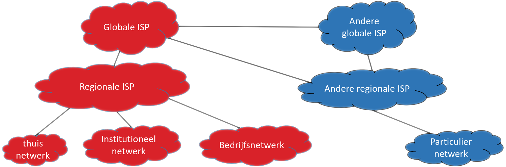

# Wat is een netwerk?
---
Een internet / Het Internet

<!-- figuur: Koen Laurent / Wouter Peetermans -->
---
Circuit switching

<iframe width="560" height="315" src="https://www.youtube.com/embed/ro-uU074bj8?si=KY1Zej7kvbR2bUC9" title="YouTube video player" frameborder="0" allow="accelerometer; autoplay; clipboard-write; encrypted-media; gyroscope; picture-in-picture; web-share" referrerpolicy="strict-origin-when-cross-origin" allowfullscreen></iframe>

note:
- dit is **niet** hoe een typisch computernetwerk werkt
---
Packet switching

<!-- Afbeelding van <a href="https://pixabay.com/nl/users/albarus-1663074/?utm_source=link-attribution&utm_medium=referral&utm_campaign=image&utm_content=4603815">René</a> via <a href="https://pixabay.com/nl//?utm_source=link-attribution&utm_medium=referral&utm_campaign=image&utm_content=4603815">Pixabay</a>-->

note:
- TCP/IP (de basis van het Internet) lijkt meer hierop
- wanneer werkt post algemeen sneller / trager dan anders?
- wat als je een hele grote zending verwacht?
- een "verbinding" bestaat alleen in de virtuele zin
---
Kenmerken packet switching

- (voortdurende) routering
- propagatie
- pakketverlies

note:
- denk aan verkeersinfrastructuur
- "bits op de kabel" (al is er niet altijd een kabel)
- noch verwerkingssnelheid, noch propagatiesnelheid is oneindig
---
Enkele basisconcepten:

- IP-adres (4 getallen)
- router

note:
- IP is een "protocol", een reeks afspraken voor communicatie
  - vraag: wat zijn de afspraken om een brief van A naar B te krijgen?
  - voorlopig genoeg te weten: toestel dat bereikbaar is over het Internet, heeft een IP-adres nodig, voorgesteld als 4 getallen tussen 0 en 255
    - realiteit is een pak complexer, maar dat was wel het oorspronkelijke idee
- **zeer sterke vereenvoudiging**, voorlopig genoeg om experimentjes te doen
---
Experimenten
---
Ping

- Windows: `ping /?`
- Mac / Linux: `man ping`
- geblokkeerd op AP-wifi en Eduroam, maar eigenlijk ongevaarlijk; kan op Bletchley

note:
- iemand die de term van ergens kent?
  - wat staat er dan vaak bij?
- geeft idee kwaliteit verbinding (snelheid respons)
- ontvanger is niet verplicht te antwoorden!
---
Opdracht

- verbind met Bletchley of zoek een online ping tool (`ping.eu`,...)
- ping volgende adressen:
  - www.marian.edu
  - telenet.be
  - www.ap.be
- noteer je antwoord op volgende vragen:
  - welke onderdelen spreken voor zichzelf?
  - welke onderdelen zijn je onbekend?
  - zijn er herhalingen? zo ja, waarom?
  - wat lijkt niet te veranderen?
  - wat zou je morgen anders verwachten?
---
Installatie-opdrachten:

- [Wireshark](https://www.wireshark.org/)
- [PacketTracer](https://www.netacad.com/cisco-packet-tracer)
  - Dit vereist dat je een account maakt.
