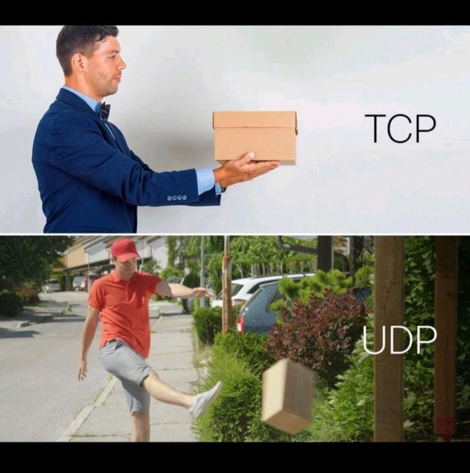

# Transportlaag

---

### Herhaling: OSI-model

---

Transportlaag?

note:
- dient voor communicatie tussen *processen* op machines, niet gewoon tussen machines
- hier spreken we over "segmenten" voor datapakketjes
---
Poorten

note:
- zoals "postvakjes" op hetzelfde adres
- nodig voor zender ("outbox") en ontvanger ("inbox")
- een proces "luistert" naar een poort
---
- 0 tot 1023: "well-known"
- 1024 tot 49151: in principe voor vaste keuzes
- 49152 tot 65535: voor willekeurige toekenning
---
Voorbeelden:

- 22
- 53
- 80
- 443
- 3306

Toegekend door IANA

Zie [Wikipedia](https://en.wikipedia.org/wiki/List_of_TCP_and_UDP_port_numbers) voor meer

note:
- 22: ssh; 80: HTTP, 443: httpS, 3306: mysql; 53: DNS
---
Sockets

note:
- unieke combinatie van **transportprotocol (TCP/UDP), IP-adres en poortnummer**
- eindpunt voor communicatie, zoals een stopcontact
- voor programmeurs: bytes in wegschrijven of bytes uit lezen
  - m.a.w. hier gaat de data van een applicatielaagprotocol in (of komt ze uit)
---
UDP

```mermaid
packet-beta
title UDP Packet
0-15: "Source Port"
16-31: "Destination Port"
32-47: "Length"
48-63: "Checksum"
64-95: "Data (variable length)"
```

note:
- denkvraag: waarom 2 bytes voor poorten?
---
- simpel
- snel
- "onbetrouwbaar"

note:
- UDP voegt eigenlijk enkel het concept van "poorten" toe aan IP.
- Pakketverlies of volgorde van ontvangst wordt niet geregeld.
- Dit protocol is vooral handig als er af en toe wat data verloren mag gaan of uit volgorde mag aankomen, maar weinig overhead gewenst is.
- Sommige netwerken blokkeren dit gewoonweg!
- (Flauw) mopje van de dag: **I wanted to tell you a joke about UDP, but you might not get it**

---
TCP

```mermaid
packet-beta
0-15: "Source Port"
16-31: "Destination Port"
32-63: "Sequence Number"
64-95: "Acknowledgment Number"
96-99: "Data Offset"
100-105: "Reserved"
106: "URG"
107: "ACK"
108: "PSH"
109: "RST"
110: "SYN"
111: "FIN"
112-127: "Window"
128-143: "Checksum"
144-159: "Urgent Pointer"
160-191: "(Options and Padding)"
192-255: "Data (variable length)"
```

---
- complexer
- connectiegeoriënteerd
  - volgnummers
  - bevestiging ontvangst
  - start met een "handshake"
- nog steeds onderworpen aan fysica
- TLS zit hier meestal "bovenop"

note:
- connectiegeoriënteerd, maar nog steeds packet switching, geen circuit switching!
- **when in doubt, use TCP!**
- Het andere flauwe mopje van de dag: **What is the similarity between a well-trained dog and TCP? They both do handshakes**

---

---

# Recap

- Poorten geven de data aan het juiste process/programma
- TCP: data komt in volgorde en normaalgezien toe
- UDP: geen garantie op toekomen of volgorde
