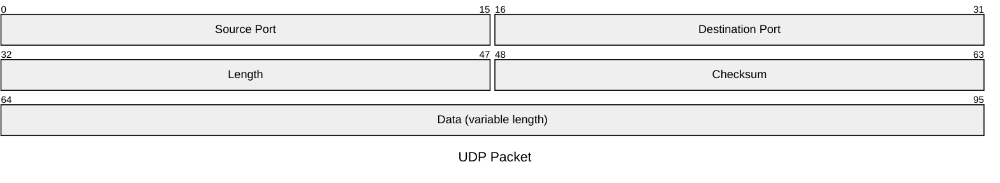
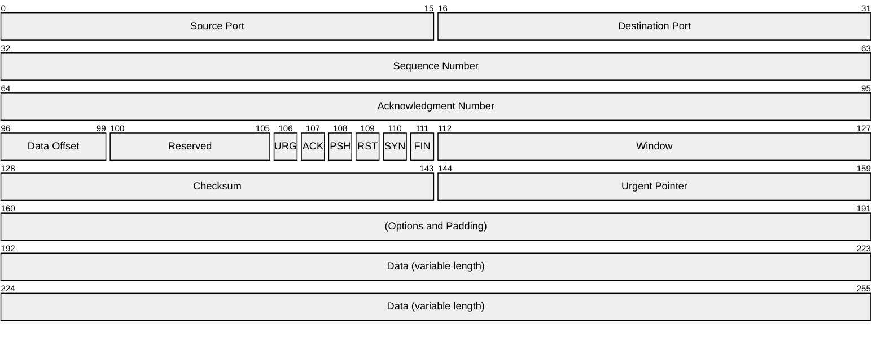
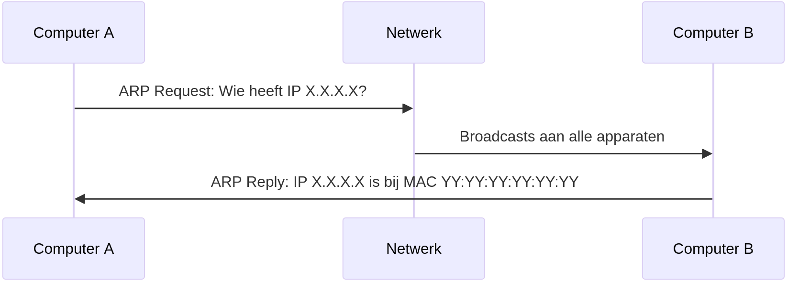

# Transportlaag en netwerklaag
---
## Transportlaag

note:
- dient voor communicatie tussen *processen* op machines, niet gewoon tussen machines
- hier spreken we over "segmenten" voor datapakketjes
---
Poorten

note:
- zoals "postvakjes" op hetzelfde adres
- nodig voor zender ("outbox") en ontvanger ("inbox")
- een proces "luistert" naar een poort
---
- 0 tot 1023: "well-known"
- 1024 tot 49151: in principe voor vaste keuzes
- 49152 tot 65535: voor willekeurige toekenning
---
Voorbeelden:

- 22
- 80
- 443
- 3306
---
Sockets

note:
- unieke combinatie van **transportprotocol (TCP/UDP), IP-adres en poortnummer**
- eindpunt voor communicatie, zoals een stopcontact
- voor programmeurs: bytes in wegschrijven of bytes uit lezen
  - m.a.w. hier gaat de data van een applicatielaagprotocol in (of komt ze uit)
---
UDP



note:
- denkvraag: waarom 2 bytes voor poorten?
---
- simpel
- snel
- "onbetrouwbaar"

note:
- UDP voegt eigenlijk enkel het concept van "poorten" toe aan IP.
- Pakketverlies of volgorde van ontvangst wordt niet geregeld.
- Dit protocol is vooral handig als er af en toe wat data verloren mag gaan of uit volgorde mag aankomen, maar weinig overhead gewenst is.
- Sommige netwerken blokkeren dit gewoonweg!
---
TCP



---
- complexer
- connectiegeoriënteerd
  - volgnummers
  - bevestiging ontvangst
  - start met een "handshake"
- nog steeds onderworpen aan fysica
- TLS zit hier meestal "bovenop"

note:
- connectiegeoriënteerd, maar nog steeds packet switching, geen circuit switching!
- **when in doubt, use TCP!**
---
## Netwerklaag

note:
- je machine beschikt over een hardwareadres genaamd een MAC-adres (medium access control)
- functie was: data van machine A naar machine B krijgen
- vraag: waarom niet gewoon MAC-adressen en switches?
- antwoord: switch onthoudt **alle** adressen achter een bepaalde poort (binnen netwerk afgebakend door router)
- heel het Internet zou één lokaal netwerk zijn, dus zouden per poort enorm veel informatie moeten bijhouden
---
| kenmerk | MAC | IP |
|-|-|-|
| sterkte associatie | "vast" | "veranderlijk" |
| structuur | vlak | hiërarchisch |
| afhankelijk van | fabrikant | subnet |
| vergelijk met | rijksregisternummer | thuisadres |
---
basisidee bereikbaarheid

note:
- vinden niet de machine, wel het (meest specifieke) subnet
- op subnet gebeurt een "broadcast"
- dus IP-adres wordt op het einde omgezet naar MAC-adres
---
IPv4 (classless)

note:

Bestaat ook ouder systeem met "klassen". Niet belangrijk voor programmeurs.

---
- 192.168.0.222
- 11000000.101...

note:
- 4 bytes = 32 bits
- je mag rekenmachine in programming mode gebruiken
---
- hostgedeelte
- netwerkgedeelte

note:
- machines op zelfde netwerk hebben zelfde netwerkgedeelte (ander hostgedeelte)
  - **in binair**, zelfde netwerkgedeelte kan voorgesteld zijn met andere reeks getallen in decimaal!
- om de twee te scheiden: netmasker nodig, zie volgende slide
---
netmasker

note:
- zelfde notatie als IP-adres, maar...
- binair altijd reeks 1'tjes gevolgd door reeks 0'en, zonder afwisseling
- afgekort tot slash-notatie
- **hoe lager de waarde, hoe groter het netwerk**
---

```text
11000000.10101000.00000000.11011110 # 192.168.0.222
11111111.11111111.00000000.00000000 # 255.255.0.0
11000000.10101000.00000000.00000000 # 192.168.0.0
```

note:

- 192.168.0.0/16 is dus het adres van het netwerk waarop 192.168.0.222 zich bevindt
  - netmasker is zelfde als voor de host, bitsgewijze AND levert de vier bytewaarden
- hoe zou je dan hostgedeelte kunnen krijgen?

---
"zit host H/X op netwerk N/Y?"

- we moeten het netwerk van H achterhalen
- neem het IP van H
- pas een netmasker van X bits toe
  - levert het netwerkgedeelte van H
  - dus: het kleinste netwerk waarin H zit
- bekijk het resultaat:
  - identiek aan N en X=Y? ⇒ ja
  - iets anders? ⇒ volgende slide
---
"is netwerk N1/X deel van netwerk N2/Y?"

- X < Y? ⇒ nee (korter netmasker = groter netwerk)
- X = Y? ⇒ enkel als N1 = N2 (zijn identiek)
- X > Y?
  - pas netmasker van Y bits toe op N1
  - is de uitkomst N2? ⇒ ja
  - iets anders? ⇒ nee
---
speciale adressen

note:
- netwerkadres (alle hostbits op 0) = adres van een netwerk zelf, niet van een machine
  - wordt niet echt op zich gebruikt, maar kan ook niet dienen voor host
  - komt omdat netmasker toepassen hier niets aan verandert
- broadcastadres: alle hostbits zijn 1, dus hoogst mogelijke adres binnen dat netwerk
  - gebruikt om een bericht naar iedereen op het netwerk te sturen
- denkvraag: hoe veel hosts kunnen we aansluiten op een netwerk met netmasker van lengte N
  - antwoord: 2^(32-N)-2 ("twee minder dan twee tot de macht H, waarbij H het aantal hostbits is")
---
Opdrachten

note:
Gebruik je rekenmachine in programmeermodus.
---
- Is 10.4.3.0/16 een geldig netwerkadres?
- Is 192.168.0.0/16 een geldig netwerkadres?
- Is 192.168.0.0/8 een geldig netwerkadres?
- Is 10.4.224.0/18 een geldig netwerkadres?
- Is 172.25.13.0/24 een subnet van 172.16.0.0/12?
- Is 172.16.0.0/13 een subnet van 172.16.0.0/12?
- Met welke eerste bytewaarde kunnen subnetten van 10.0.0.0/8 allemaal beginnen?
- Met welke eerste twee bytewaarden kunnen subnetten van 200.16.0.0/12 allemaal beginnen?
---
                            <p>Gegeven:</p>
                            <ul>
                                <li>IP-adres: 192.168.1.13</li>
                                <li>lengte netmasker: 27</li>
                            </ul>
                            <p>Gevraagd:</p>
                            <ul>
                                <li>Netwerkadres</li>
                                <li>Broadcastadres</li>
                                <li>Hostgedeelte (binair)</li>
                                <li>Eerste en laatste hostadres subnet</li>
                                <li>Maximaal aantal hosts</li>
                            </ul>
---
                            <p>Gegeven:</p>
                            <ul>
                                <li>IP-adres: 172.16.5.88</li>
                                <li>lengte netmasker: 20</li>
                            </ul>
                            <p>Gevraagd:</p>
                            <ul>
                                <li>Netwerkadres</li>
                                <li>Broadcastadres</li>
                                <li>Hostgedeelte (binair)</li>
                                <li>Eerste en laatste hostadres subnet</li>
                                <li>Maximaal aantal hosts</li>
                            </ul>
---
                            <p>Gegeven:</p>
                            <ul>
                                <li>IP-adres: 10.4.3.2</li>
                                <li>lengte netmasker: 18</li>
                            </ul>
                            <p>Gevraagd:</p>
                            <ul>
                                <li>Netwerkadres</li>
                                <li>Broadcastadres</li>
                                <li>Hostgedeelte (binair)</li>
                                <li>Eerste en laatste hostadres subnet</li>
                                <li>Maximaal aantal hosts</li>
                            </ul>
---
IP-adressen voor:

- subnetten (netwerk en broadcast)
- routers
- hosts
- **niet** voor modems, hubs of switches

note:
voor routers minstens twee
---
                Routers
                <aside class="notes">
                    <ul>
                        <li>in essentie gewoon toestel met twee of meer fysieke netwerkinterfaces (i.e. loopback
                            etc. telt niet)</li>
                        <li>soort verkeersagent: inspecteert adresinformatie en stuurt door op juiste interface</li>
                        <li>gewone hardware kan als router optreden (als je twee netwerkinterfaces hebt).</li>
                        <li>draadloze hotspot is vorm hiervan</li>
                    </ul>
                </aside>
---
                (Default) gateway
                <aside class="notes">
                    <ul>
                        <li>"gateway" wijst op grens tussen systemen.</li>
                        <li>in netwerkconfiguratie wordt hiermee bedoeld: router die dit netwerk van de rest afbakent
                        </li>
                        <li>Moet dus bereikbaar zijn op het netwerk.</li>
                    </ul>
                </aside>
---


note:

- Eens op juiste netwerk doet machine een broadcast om te vragen wie een bepaald IP heeft.
- Het is dus genoeg om iets tot bij de router te krijgen die aangesloten is op dat subnet.

---
Demo: invullen routeringstabel
---
                Toekenning van adressen
                <aside class="notes">
                    <ul>
                        <li>kan statisch</li>
                        <li>kan geautomatiseerd (typisch gewoon <strong>een</strong> vrij adres nodig)</li>
                        <li>werking DHCP is niet te kennen, als je weet dat het er is, zet je het gewoon aan</li>
                        <li>ISP,... heeft blokken gekocht</li>
                        <li>netmasker in PT <strong>klopt niet altijd</strong></li>
                    </ul>
                </aside>
---
Opdracht

note:
Ken adressen toe. Maak connectiviteit mogelijk.

---
Achilleshiel IPv4

note:

Stel dat heel het Internet één groot lokaal netwerk was (en dat we toch IPv4 gebruikten), hoe veel adressen dan? (toon met rekenmachine)
---
NAT (PAT)

note:
- Netwerkadresvertaling / Network Address Translation
- Vergelijk: ipconfig en myip.com
- (indien IPv4): zal voor iedereen **zelfde** zijn!
---
                <iframe width="560" height="315"
                    src="https://www.youtube.com/embed/2t8-WRZWCq8?si=IbcDw07DOS24lm2u&amp;start=47"
                    title="YouTube video player" frameborder="0"
                    allow="accelerometer; autoplay; clipboard-write; encrypted-media; gyroscope; picture-in-picture; web-share"
                    allowfullscreen></iframe>
                <aside class="notes">
                    <ul>
                        <li>bestaan variaties op het concept, maar dit is wat je typisch moet weten als programmeur</li>
                        <ul>
                            <li>sommige zaken moeten <strong>eerst</strong> de connectie opstarten</li>
                            <li>poort die zichtbaar is aan ontvangerkant is niet noodzakelijk echte poort van de
                                afzender</li>
                            <li>PAT doorbreekt protocolstapel</li>
                            <li>nadeel: routers moeten details van TCP/UDP kennen, zijn wel dominant maar hindert andere
                                zaken die bovenop IP staan</li>
                            <li>screenshot port forwarding Telenet settings = <strong>dit</strong></li>
                            <li>NAT/PAT doet al vrij lang goed dienst, maar is een "hack". Manuele port forwarding is
                                soms nodig, nieuwe protocols bovenop IP implementeren is lastig.</li>
                            <li>truukje "hole punching" (en reden) moet je kennen voor applicaties</li>
                        </ul>
                    </ul>
                </aside>
---

