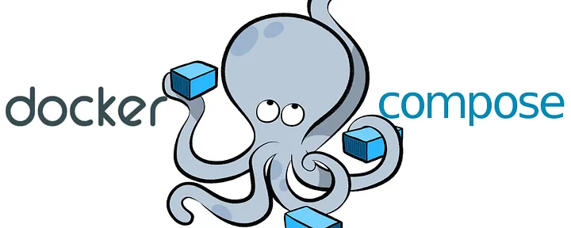

# Container orchestration
---
Demonstratie: Express applicatie uitbreiden

note:
- "met manuele MySQL"
---
- `docker network create NETWERKNAAM`
- `docker network rm NETWERKNAAM`
- `docker network ls`
- `docker run --network NETWERKNAAM ...`
- `docker network connect NETWERKNAAM CONTAINERNAAM`
---
DNS-resolutie in Docker

note:
- namen van containers als hostnamen gebruiken (intern DNS-systeem)
- dit werkt alleen op expliciet aangemaakte netwerken, niet op het automatisch aangemaakte `bridge` netwerk!
---
Opdracht: uitbreiden met Mailhog

note:
- download de code voor het guest book met Mailhog
- configureer de containers zodat de volledige applicatie werkt
---

note:
- kan command line argumenten bijhouden in file
- kan meerdere containers samen opstarten, meteen in netwerk, met volumes
- gebruikt YAML syntax
- intro tot YAML en YAML converter gelinkt
---
Demonstratie: omzetting volledige applicatie
---
- `docker compose build`
- `docker compose up`
- `docker compose down`
---
## Aandachtspunten
---
- netwerken: impliciet vs. expliciet
- volumes definiëren, mounted folders niet
- ports: host:guest, niet omgekeerd
- `depends_on`: container is **gestart**, niet altijd **klaar**
  - voeg bijvoorbeeld script toe
- `environment`: omgevingsvariabelen voor configuratie en secrets
---
Workshop (deel 3)

note:
- Azure Container Instance ≅ Amazon ECS
 - meer "managed"
- Azure Virtual Machines ≅ Amazon EC2
 - meer eigen controle, maar ook meer eigen werk
- Doorlopen "Deploy a Docker image to an Azure Container Instance". Niet overal hetzelfde als in schriftelijke uitleg ⇒ vraag het aan de lector!
- Wissen resource group op het einde: moet specifiek op detailpagina van die groep staan.
---
Docker (Compose) op Azure Virtual Machines

note:
- neem volledige guest book applicatie als voorbeeld
- maak een VM aan
- installeer Docker met Compose
- zorg dat alle nodige bestanden op de VM staan (`scp` of `git`)
- controleer dat de applicatie bereikbaar is
