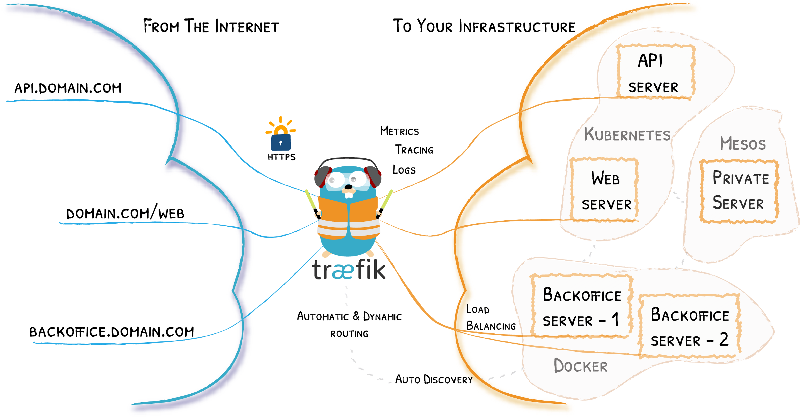

Workshop (deel 3)

note:
- Azure Container Instance ≅ Amazon ECS
 - meer "managed"
- Azure Virtual Machines ≅ Amazon EC2
 - meer eigen controle, maar ook meer eigen werk
- Doorlopen "Deploy a Docker image to an Azure Container Instance". Niet overal hetzelfde als in schriftelijke uitleg ⇒ vraag het aan de lector!
- Wissen resource group op het einde: moet specifiek op detailpagina van die groep staan.
---
[Oefening](https://github.com/v-nys/BaseApp)

note:
- hou geheime info uit versiebeheer d.m.v. een file met omgevingsvariabelen!
---
Docker (Compose) op Azure Virtual Machines

note:
- neem eerdere applicatie als voorbeeld
- maak een VM aan
- installeer Docker met Compose
- zorg dat alle nodige bestanden op de VM staan (`scp` of `git`)
- controleer dat de applicatie bereikbaar is
---
Traefik

note:
- reverse proxy
  - kan dus kenmerken van inkomend verkeer bekijken (hostnaam,... zelfs als IP gelijk is)
  - kan deze gebruiken om de juiste achterliggende service aan te spreken
  - verschillende voordelen
    - extra tussenstop is handig voor monitoren / beveiligen / ... diensten
    - mogelijk meerdere applicaties op dezelfde server te runnen zonder dat gebruiker hier iets van merkt (domeinnamen zijn anders)
    - kan dit via configuratiefile **of** door metadata die aan containers wordt gekoppeld ("labels")
- **erg uitgebreid, we bekijken gewoon basis**
---

---
- entrypoints
- routers
- middleware
- services

note:
- entrypoints geven aan hoe de setup bereikt kan worden (protocol, poort,...)
- routers geven aan hoe een inkomend request doorgestuurd kan worden naar een dienst achter de proxy
- middleware herschrijft een request (bv.: intern wordt geen HTTPS gebruikt en web servers kennen dat meestal ook niet, dus herschrijf naar HTTP)
- services: wat achter de proxy zit
  - Traefik "wrapt" deze, bijvoorbeeld door meerdere instanties met load balancing te behandelen als één service
---
```yaml
services:
  reverse-proxy:
    image: traefik:v3.2
    # dit voegt extra opties toe aan het defaultcommando
    # in de Dockerfile voor Traefik staat "entrypoint"
    # dat deel is vast
    command: --api.insecure=true --providers.docker
    ports:
      - "80:80"
      - "8080:8080" # web UI, kan door api.insecure=true
    volumes:
      # zo kan Traefik meteen reageren op wijzigingen containers
      - /var/run/docker.sock:/var/run/docker.sock
```

note:
- Traefik kan ook met andere systemen werken, maar hier wordt het nu eenmaal opgestart in Docker (Compose)
- Run dit al een keer, toon web UI
  - bekijk entrypoints (HTTP entrypoint = TCP op poort 80,...)
  - tabs bovenaan: HTTP, TCP, UDP geven routers, services en middleware **voor die protocols**
    - M.O.: HTTP krijgt dus speciale behandeling want is bovenop TCP (en HTTP3 uiteindelijk bovenop UDP)
  - klik op een router om in detail te bekijken
    - rule drukt uit wanneer die router zal doorsturen naar bepaalde service
      - `Host` voor wanneer we de reverse proxy bereikt hebben via bepaalde hostnaam
      - `PathPrefix` voor wanneer onderdeel voorkomt vooraan in pad (na domeinnaam): zie bv. `http://localhost:8080/api/entrypoints`, is niet op dashboard
